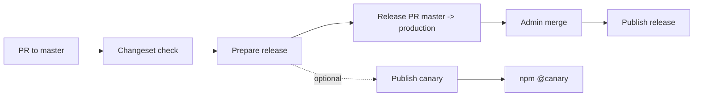

# Release Pipeline Overview

This pipeline automates versioning and publishing for a multi-package app, with admin-controlled production releases and optional canary snapshots.

## How it works

1. A developer opens a PR targeting `master`.
2. CI checks release intent: PRs that touch publishable packages must include a manual `.changeset/*.md`, unless explicitly marked `[skip-changeset]`/`skip-changeset`.
3. The PR is reviewed and merged into `master`.
4. **Prepare release** computes version bumps and opens/updates `master -> production`.
5. Admin merges `master -> production`, and that push triggers **Publish release**.

## CI/CD pieces

- **GitHub App**: acts as release bot for workflow commits/automation.
- **changeset-check**: validates release intent per PR.
- **release-prepare**: bumps versions, updates changelogs, opens release PR.
- **release-publish**: publishes to npm on `production` push; supports admin retry mode.
- **release-canary**: manual canary snapshots (`@canary`) without affecting `latest`.

## How to use

- **Normal release**
  - Merge feature/fix PRs into `master`.
  - Run **Prepare release**.
  - Review and merge `master -> production`.
  - Publish runs automatically on `production`.

- **Canary release**
  - Run **Publish canary release**.
  - Select package scope (`All modified packages` or a specific package).
  - Publishes snapshot versions under `@canary`.

- **Retry failed production publish**
  - Run **Publish release** with `mode=retry-production` (admin-only).

## Changeset behavior

- **Required gate for publishable changes**: if a PR changes publishable packages, you must provide one of:
  - a manual `.changeset/*.md` file committed in the PR
  - `skip-changeset` label or `[skip-changeset]` for internal-only changes
- **Failure mode**: if none of the above is present, `changeset-check` fails.
- **Skip mode**: use `skip-changeset` label or `[skip-changeset]` for internal-only PRs.
- **Selective release**: workflows support package filtering via `packages` input.

### Pre-1.0 versioning rule (`0.x`)

For packages still on `0.x`, this pipeline does not fully apply strict semver majors when versioning from changesets:

- `patch` -> patch bump (`0.2.0` -> `0.2.1`)
- `minor` -> minor bump (`0.2.0` -> `0.3.0`)
- `major` -> treated like minor (`0.2.0` -> `0.3.0`, not `1.0.0`)

## Security model

- **OIDC-only npm publish**: no long-lived npm token required.
- **Admin-gated production**: production release path is controlled by branch protections and admin review.
- **Canary isolation**: canary publishes do not move `latest` and do not create production tags/releases.
